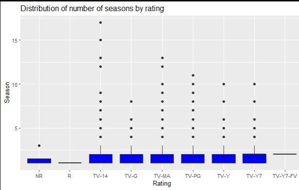

# Netflix TvShows Analysis

The scatterplot examines the relationship between the year of release for TV shows and the number of seasons each show had. By visualizing this data, it becomes evident that shows in recent years tend to have more seasons compared to those released in the past. This observation suggests a potential shift in audience preferences or production strategies in the television industry.

The box plot provides insights into the distribution of the number of seasons based on ratings. This visualization helps identify any variations or trends in the number of seasons across different rating categories. By analyzing this information, we can gain a deeper understanding of how the rating of a TV show relates to the duration of its success or viewership.

The bar plot represents the number of movies falling into different genres. This visualization allows for a comprehensive overview of the genre distribution within the dataset. By examining the bar plot, we can identify the most prevalent genres and gain insights into the diversity of movies available across various genres.

The heatmap presents a visual representation of movie ratings in relation to the number of seasons and the country of origin. This allows for a multi-dimensional analysis of the data, exploring the interplay between ratings, duration, and geographic factors. The heatmap helps to identify any correlations or patterns that may exist between these variables, providing valuable insights into the factors influencing movie ratings and production.

